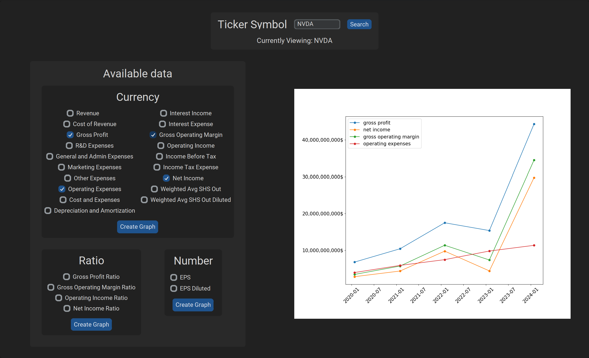

# Income Statement Analzer

## Graph income data from any company. 

This is by no means a professional project, just something put together to test out a free version of an API.

This program uses:
- [FMP's API](https://site.financialmodelingprep.com/developer/docs)
- [CustomTKinter](https://felipetesc.github.io/CtkDocs/#/)
- [Matplotlib](https://matplotlib.org/stable/index.html)

Here are the instructions on how to install these packages:
1. Open up your integrated terminal
2. Create a virtual environment *(optional but highly reccomended to avoid cluttering)* Follow these steps:
   - ```python3 -m venv myenv```: replace "myvenv" with the name of your virtual environment
   - ```venv/bin/activate```: activate the virtual environment by running the activate script
4. Make sure you have [pip](https://pypi.org/project/pip/) installed
5. run these following commands:
   - ```pip install requests``` : for making request to the FMP API
   - ```pip install matplotlib```: to be able to visualize income statements as a graph
   - ```pip install customtkinter```: to be able to run the UI

## How it works:
You first enter the ticker symbol of the company you wish to evaluate

Three types of data is available to plot:
1. <ins>**Currency:**</ins> For metrics over 1000$
2. <ins>**Ratio:**</ins> Scales in between 0 - 1
3. <ins>**Number:**</ins> For metrics under 1000$

Graph can be created from any three, the graph will update and replace the last each time one is created.

Seeing as this is the free API plan, historical data only accounts for the past 5 years. However, if you wish to [purchase a premium plan](https://site.financialmodelingprep.com/developer/docs/pricing), you may replace the ```API_KEY``` variable in the script with your own, and alter the ```years``` variable to your liking.

## Picture of the Program


## Features to be added
- Tooltip: Hovering over the elements gives you theif function
- Interactive Graph: Be able to zoom and move around the embedded graph
